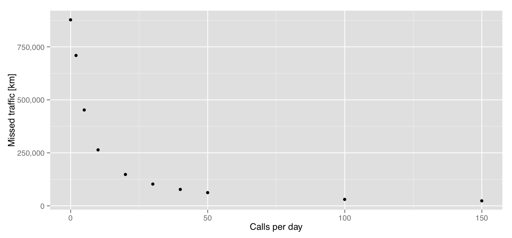

## Mobile Phone Data in MATSim

##### Michael Zilske
###### hEART 2017 Haifa

---

As inputs to travel models, household surveys are expensive.
Mobile phone data could be an alternative.

 <!-- .element width="50%" -->

---

Given mobile phone data, one can e.g.

- Distinguish activities/trips
- Assign home/work locations
- Detect mode of transport
- Measure occupancy of facilities / vehicles
- Model leisure traffic

- Using additional data
    - counts
    - census
    - land use

The result will be a model from which initial plans for MATSim can be drawn.

note:
Assuming that the goal is to set up MATSim or something similar.

---

### MATSim

- Input:
    - Set of agents with travel diaries as initial plans
    - Utility parameters

- Iterate:
    - Agents concurrently execute plans on network.
    - Agents improve utility given network conditions in
        - activities (end time)
        - trips (route, mode of transport)

note:

Fix some dimensions of the input; Mutate others, maximizing utility
given traffic conditions.

---

This work: given location data, use traces directly as input

 <!-- .element width="50%" -->

note:
The transition from the previous picture to this one basically shows what I am going to do: I am going to more or less directly
use location traces in place of initial plans in MATSim.

---

- Input:
    - Set of agents with travel chains (connecting observations) as initial plans

- Iterate
    - Agents concurrently execute plans on network.
    - Agents improve likelihood of plan given observations, network conditions
        - activities (location, end time)
        - trips (route)

note:
Agent decides if its movement is feasible: Can it be at its witnessed locations in time?

---

An agent trying to produce minimal behavior consistent with location data would:

- Do activities at witnessed locations
- Connect them with trips

- Pick departure times anywhere between witnessed instant and the latest required departure time to reach the next location in time

---

Consider sparse location data:

- Not all activity locations will be witnessed, so trips will be missing.
- Uncertainty about start and end times of witnessed activities.
- Ambiguity about whether location data point is at an activity location or on a trip.

 <!-- .element width="70%" -->

- Truth (blue), one random realization (red)
- Constant intervals: Activities. Trips interpolated with constant speed
- Constraints (black) induced by measurements (tickmarks)

---

Such an agent will, compared to its real counterpart

- Have some activities at locations where, in reality, there was none. (But which the individual still visited while passing through.)
- Do fewer activities
- Travel less

 <!-- .element width="50%" -->

note:
Note that even with a high average call rate of 50 calls per day, the approach still misses about 10% of traffic. Thus, in order
to make this procedure practically useful, some compensation method needs to be devised.
The most available method of compensating for something is Cadyts.

---

### Cadyts

- Add scoring term which fits population behavior to traffic counts
    - Prefer plans which use links where simulated flow is smaller than observed flow

- Has been used with variable (uncertain) population size.
    - Agent can choose to not exist

---

### Cadyts

- Now: Use traffic counts to

    - reduce temporal uncertainty
    - reduce bias towards minimal activity

- Problem: Replanning must produce plans with enough variability in all
relevant dimensions. Here: Number of activities, which are now near the lower bound.

- Idea: Use *denser* traces as templates to expand sparse traces.

---

 <!-- .element width="30%" -->

A dense trace (red) and a sparse trace (black). Projection: Distance from first location.
Both traces could result from similar underlying behavior.

note:
If we only simulated movement for which we have direct evidence from observations,
the travelled distance of black would be underestimated.

---

|   |   |
|---|---|
| <!-- .element width="50%" --> | <!-- .element width="50%" --> |
| <!-- .element width="50%" --> | <!-- .element width="50%" --> |

- Add new points to the sparse trace which correspond to points of the dense trace
- Randomize locations of these points by a geometric construction such that trip lengths correspond to those
of the dense trace

---

<!-- .element width="50%" -->

- All-day travel distance distribution over individuals.
- Distorted, but improved once calibrated against hourly link counts.

---

Consider dense location data:

- Activities will be more clearly delineated
- Many data points will recognizably be from trips

 <!-- .element width="70%" -->

Using the same strategy as in the sparse case will

- Produce many more activities, some of them very short
- Exhibit less reaction to feedback from the transport system: Will not change its route, even if another is faster

---

Prototype activity/trip distinction:

- Remove activities where there is little slack (t) in choosing end time
    - Because they are likely not actual activities but waypoints
    - Reproduces real number of activities in test scenario when t is set to 10 min.

---

### Synthetic CDRs by simulation

Input:
- Full transport scenario (simulated individuals executing all-day travel plans): Synthetic ground truth
- Cell coverage, which partitions the simulated geographic area into mobile phone cells.
- Mobile phone usage model.
    - Each agent can decide in every time step whether or not to place a call
    - Allows investigating non-homogeneous calling behavior

Output:
- Synthetic CDR data set.
- Anything which can be skimmed from the simulation. In particular: link counts.

---

### Conclusion

When using location data with MATSim, one can either

- Build a population model from location data, construct initial demand from that, simulate (with counts as side input).

- Or (this work): Build trip chains, simulate flows directly (with counts as side input), then impute behavior.

- Agent oriented simulations are natural algorithm testbeds
    - Start with a well-studied base case
    - Produce *synthetic* phone data
    - Try algorithms for activity/trip/mode/occupancy detection
    - Compare to base case as ground truth

note:
Diagram only?

---

### Next

- More sophisticated algorithms (from the literature). Those in this work are very simple.

- More sophisticated likelihood function. Currently binary: Possible or impossible.

---

### Thank you for listening

And being here for the last session.

michael.zilske@tu-berlin.de